# Portfolio Tracker

A personal portfolio dashboard that tracks a real brokerage account day-to-day and puts
institutional-grade performance and risk analytics — the kind normally locked inside
brokerage/quant tooling — in front of a single investor.

It ingests an append-only transaction ledger (buys, sells, dividends, splits, deposits,
withdrawals), reconstructs daily positions and cash from it, pulls in daily market data,
and turns that history into time-weighted returns, benchmark comparisons, factor exposure,
correlation/PCA diversification analysis, and more — refreshed automatically every trading day.

## Overview

The landing page — current value, today's move, total return, CAGR, and excess return vs.
SPY and QQQ side by side, a "growth of $100" chart since inception, and concentration stats
(effective number of holdings, top-5/10/20 weight).

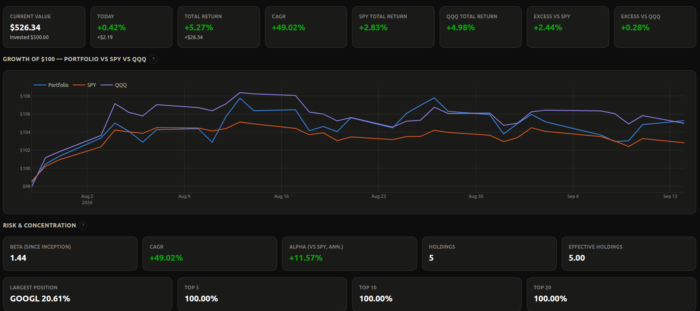

## Performance

The deepest page in the app. For any selected range (inception, YTD, 1M/3M/6M/1Y, or a
custom window):

**Growth of $100** and **matched-cash-flow dollar value** vs. SPY/QQQ — benchmarks receive
the same external cash flows on the same dates, so the comparison isn't distorted by when
money came in or out — alongside **daily and cumulative time-weighted return**.

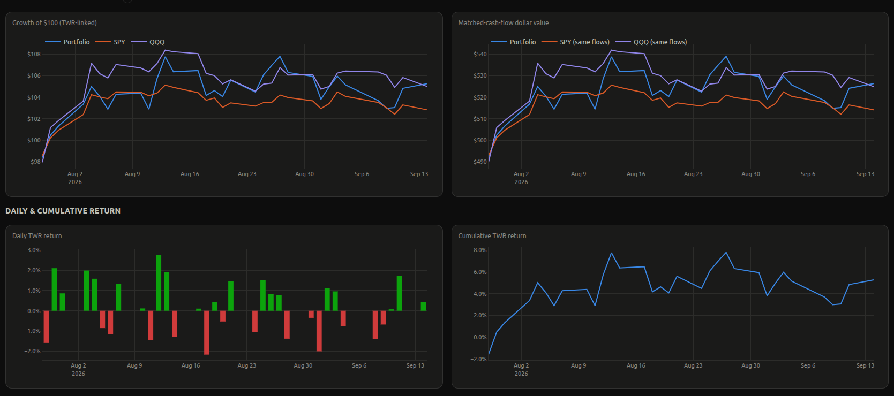

**Drawdown** vs. both benchmarks:

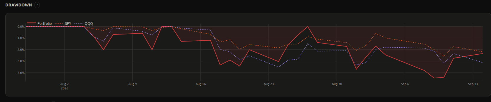

**Rolling statistics** — beta, annualized volatility, and correlation vs. SPY/QQQ — over
30/90/252-day windows, plus a period-return table and a since-inception stats table (CAGR,
volatility, max drawdown, Sharpe, Sortino, Calmar, beta, R², correlation, alpha, information
ratio) for the portfolio, SPY, and QQQ side by side:

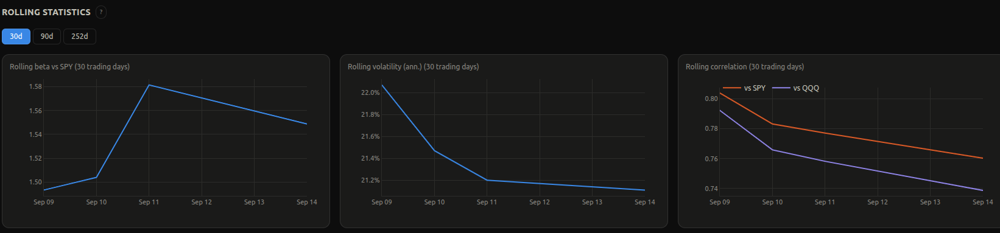

A **GitHub-style daily return calendar** and a **monthly returns heatmap**:

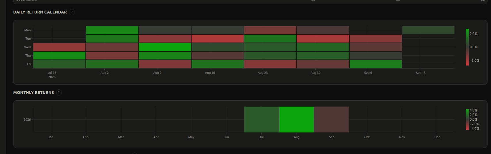

A **Monte Carlo simulator** — it compares the actual stock picks against N random,
equal-weight, same-size baskets drawn from the S&P 500 universe, all invested on the same
date, and reports what percentile the real picks landed in against pure chance. The chart
below shows the actual portfolio (blue) threading through 50 random-pick simulations,
beating the median and mean of chance selection:

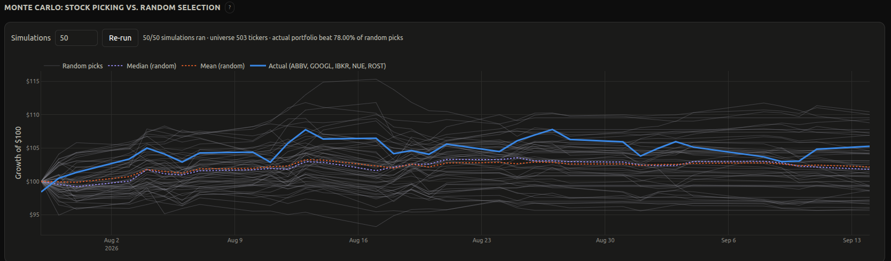

## Holdings

A sortable, searchable table of every position (shares, cost basis, price, weight, day and
total return, beta, beta contribution), a sector-allocation donut, and a holdings treemap
(tile size = value, color = today's return) — plus a top-holdings bar chart, a concentration
curve, target-vs-current drift, and per-holding return contribution further down the page.

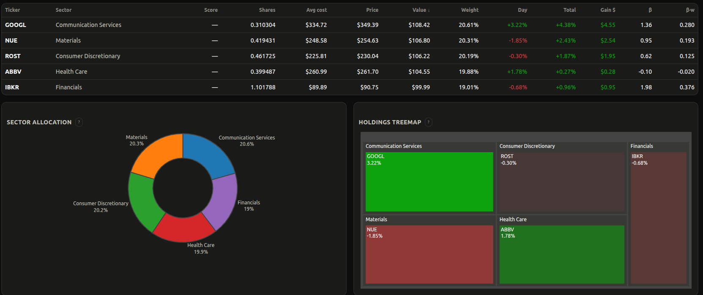

## Heatmap

A SPY-style sector treemap of the whole book — tile size is portfolio weight, color is
return over the selected period (daily/weekly/monthly/since-inception) — plus a
weight-weighted sector performance bar chart.

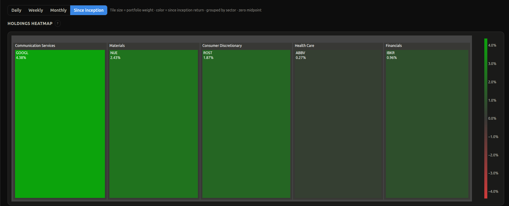

## Risk

The quant toolbox: trailing beta and correlation vs. SPY/QQQ, historical VaR/CVaR at 95% and
99%, security beta contributions, and contribution to risk by holding and by sector — plus
two deeper diversification views.

**Diversification via PCA** — principal component analysis on the trailing correlation
matrix of current holdings: effective number of independent bets (not just position count), a
variance-explained scree plot, and the dominant factor's top loadings.

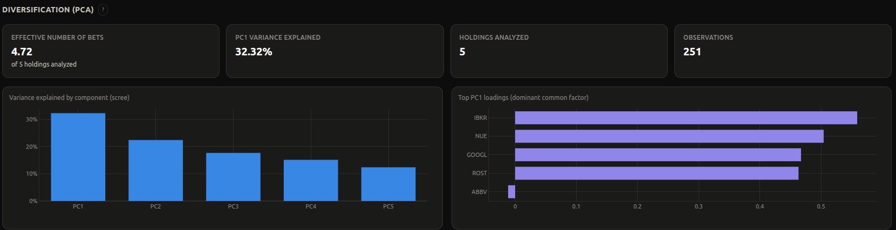

**Correlation matrix** — full pairwise Pearson correlation across holdings, so you can see
directly which positions actually move together instead of inferring it from sector labels.

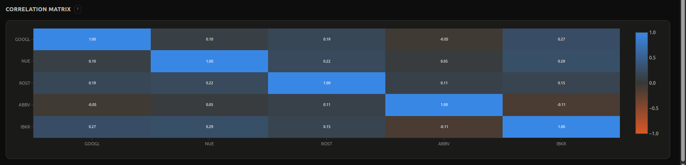

Also on this page: **factor exposure** to momentum, value, quality, low-volatility, and
small-cap style ETFs, to surface style concentration that sector diversification alone
wouldn't catch.

## History

Fully closed-out positions with realized gain and CAGR, and a timeline of composition-change
events — what was added/removed and how sector allocation shifted at each rebalance. The
snapshot below is a real rebalance this account went through, captured with before/after
holdings and sector mix:

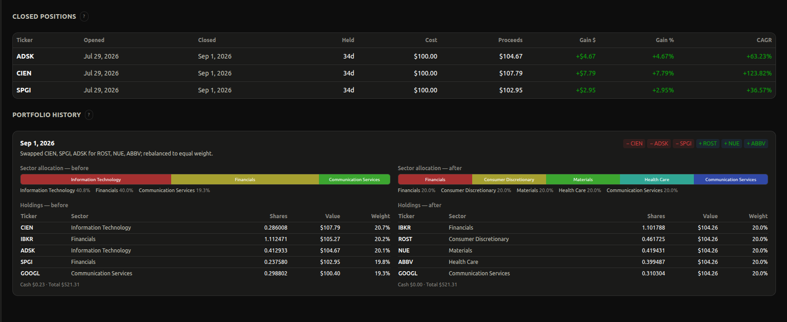

## Transactions

The full, append-only ledger — every buy, sell, dividend, deposit, withdrawal, fee, split,
and symbol change — filterable and searchable, with CSV import/export so new activity is a
data change, never a code change. The rebalance visible above (swapping CIEN/SPGI/ADSK for
ROST/NUE/ABBV) is just new rows here — no code changes required.

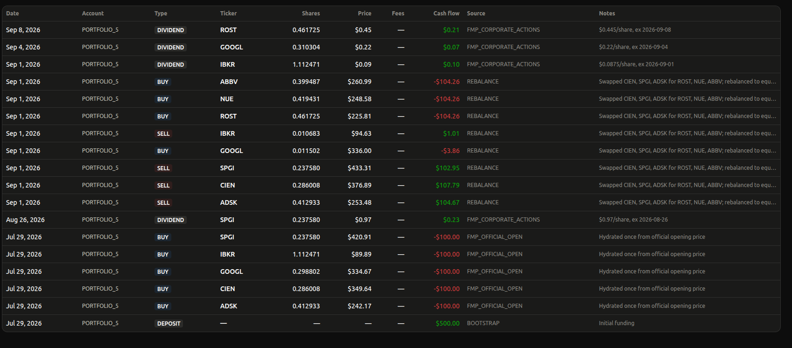

## Data Quality

A transparency page: sync status per symbol, stale/failed price fetches, and refresh-run
history, so it's always clear how fresh and complete the underlying data is.

---

## How it works, in short

- **Ledger-first**: nothing is ever edited in place — daily positions, cash, and returns are all
  reconstructed from an append-only transaction log.
- **Time-weighted returns (TWR)** for performance that isn't distorted by when cash moved in or
  out, geometrically linked daily; **XIRR** for money-weighted, dollar-actual returns.
- **Benchmarks** (SPY, QQQ) receive the identical external cash flows on the identical dates, so
  "vs. benchmark" comparisons are apples-to-apples.
- **Beta, alpha, VaR/CVaR, factor exposure, and PCA-based diversification** are computed directly
  from daily return history — never approximated from vendor betas or static weights.
- Prices refresh automatically on a daily schedule; intraday data is marked provisional until
  the next end-of-day pass confirms it.

Full methodology — the exact formulas, edge-case handling, and invariants — is documented on the
in-app **Methodology** page and in [PROJECT_SPEC.md](PROJECT_SPEC.md).

## Stack

FastAPI + SQLAlchemy + pandas backend · React + TypeScript + Vite + Tailwind + Plotly frontend ·
Financial Modeling Prep (FMP) market data · SQLite storage · APScheduler for end-of-day refresh ·
Docker Compose for deployment.

For setup and local development instructions, see [SETUP.md](SETUP.md).
